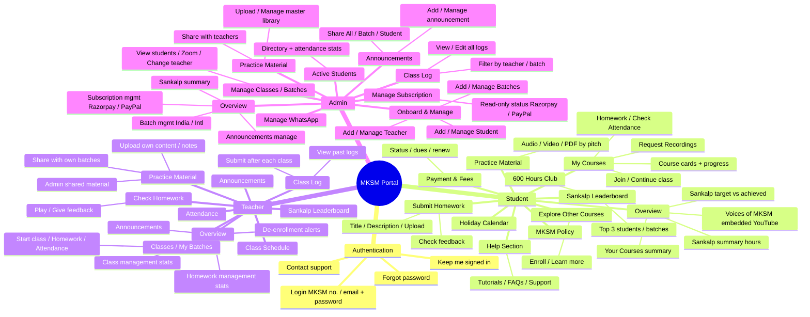
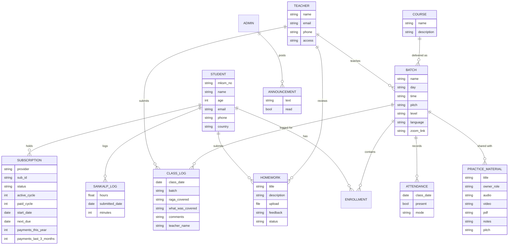

# MKSM Student Portal — Feature PRD

**Product:** Mahesh Kale School of Music (MKSM) Student Portal
**Source:** Balsamiq wireframe ("New board 1")
**Roles:** Student · Teacher · Admin (role-based access after a shared login)

---

## 1. Product Overview

A web portal for an online music school that lets **students** learn (courses, practice material, homework, progress), **teachers** run classes (batches, homework review, attendance), and **admins** operate the business (onboarding, subscriptions, batches, announcements).

A cross-cutting concept is **"Sankalp"** — a cumulative practice-hours pledge with a leaderboard and a school-wide target (30,000 achieved of a 50,000-hour goal).

---

## 2. Personas / Roles

| Role | Landing screen | Primary goals |
|------|----------------|---------------|
| **Student** ("Hi Melody!") | Overview | Attend classes, submit homework, practice, track Sankalp hours, view subscription status |
| **Teacher** ("Hi Guru!") | Overview | Manage batches, review homework, track attendance, share practice material |
| **Admin** ("Hi Admin!") | Overview | Onboard users, manage batches, monitor subscriptions, publish announcements |

---

## 3. Feature Map

---

## 4. Navigation / Site Architecture

```mermaid
flowchart TD
    Login[/"Login (shared)"/] --> Role{Role}

    Role -->|Student| S0[Student Overview]
    Role -->|Teacher| T0[Teacher Overview]
    Role -->|Admin| A0[Admin Overview]

    subgraph Student
      S0 --> S1[My Courses]
      S0 --> S2[Practice Material]
      S0 --> S3[Submit Homework]
      S0 --> S4[Sankalp Leaderboard]
      S0 --> S5[Payment & Fees]
      S0 --> S6[Explore Other Courses]
      S0 --> S7[Holiday Calendar]
      S0 --> S8[Help Section]
      S0 --> S9[MKSM Policy]
    end

    subgraph Teacher
      T0 --> T1[Classes / My Batches]
      T0 --> T2[Practice Material]
      T0 --> T3[Check Homework]
      T0 --> T4[Class Schedule]
      T0 --> T5[Attendance]
      T0 --> T6[Class Log]
      T0 --> T7[Sankalp Leaderboard]
      T0 --> T8[Announcements]
    end

    subgraph Admin
      A0 --> A1[Manage Classes / Batches]
      A0 --> A2[Active Students]
      A0 --> A3[Practice Material]
      A0 --> A4[Add Student]
      A0 --> A5[Add Teacher]
      A0 --> A6[Add Batch]
      A0 --> A7[Manage Subscription]
      A0 --> A8[Manage WhatsApp]
      A0 --> A9[Announcements]
      A0 --> A10[Class Log]
    end

    S0 & T0 & A0 -.Log Out.-> Login
```

---

## 5. Feature Breakdown & Requirements

### 5.0 Authentication (shared)
- Sign in via **MKSM number or email** + password; "Keep me signed in"; "Forgot password"; support contact.
- On success, route the user to their **role-specific Overview**.
- Persistent chat/help widget ("Hi there! How can we help you?") across authenticated screens.

### 5.1 Student

| Feature | Requirements |
|---------|--------------|
| **Overview** | Greeting; **Subscription status** badge (read from Razorpay/PayPal); "Your Courses" cards; **Sankalp summary** (self-reported hours, keyed to the 6-digit MKSM no.); **Voices of MKSM** = embedded **YouTube link** the admin swaps monthly (no in-portal submission/moderation); school Sankalp target (50,000) vs achieved (30,000). |
| **My Courses** | Course cards with quick actions: **Homework**, **Check Attendance** and **Request Recordings** (available **only here — not on Overview**; fulfilled manually by admin/teacher); **Join Now** (on class day → redirects to Zoom and **auto-marks attendance Present (Online)**) / **Continue**; per-course **progress bar**; tabs for *Your Courses* / *Practice Material*. |
| **Practice Material** | Content list with **Audio (pitch variants C#/G#/B#)**, **Video (Watch Now)**, **PDF (Open Now)**; access scoped by batch. |
| **Submit Homework** | Weekly, tied to the class schedule: student **selects the class date**, adds Title/Description, **file upload**; must submit **≥2 days before the next class** — later submissions accepted but tagged **"Late Submission"**; **Check Feedback for Homework** (month filter + search; teacher's written and audio feedback). |
| **Sankalp Leaderboard** | Month filter; tabs — **Top 3 Student Ranking**, **Top 3 Batch Ranking**, **600 Hours Club**; table: Position, Student, Batch, Cumulative Hours, Last Submitted Mins/Date, Submission Count. |
| **Payment & Fees** | Table: Course, Subscription/Payment status, Days-to-renew, Pending dues; **Re-activate subscription**, **Change payment method**. |
| **Explore Other Courses** | Course catalog cards with **Enroll Now** + **Learn More**. |
| **Holiday Calendar** | 2026 calendar/table of holidays. |
| **Help Section** | Tabs: **Tutorials / FAQs / Support Request**; search; how-to videos (getting started, submit homework, request a recording, subscription info). |
| **MKSM Policy** | Static policy content. |

### 5.2 Teacher

| Feature | Requirements |
|---------|--------------|
| **Overview** | **Announcements** (unread count, mark-all-read, open); **Homework mgmt** (Submitted / Reviewed / Review Pending / Homework Pending counts) with *Review Homework*; **Class mgmt** (batches, students, *Attendance*); **Pending Class Log reminder** — if a class ran the **previous day** and no log was submitted, show a prompt linking to the Class Log form; **De-Enrollment (DEA) alerts** (e.g. "DEA-3: Akash Patil [Dhun Batch]", *View De-Enrollment List*) — visible **only for the teacher's own batches**; **Sankalp Target / Achieved** hours. |
| **Classes / My Batches** | Batch cards (name, day, time, teacher) with **Start Class**, **Homework**, **Check Attendance**; *View All Batches*. |
| **Check Homework** | Filter by batch/month + search; homework cards with **audio player** and **Give Feedback**. |
| **Practice Material** | Two sources: **(a) Admin-shared library** — material uploaded by admin and shared with the teacher, which the teacher can **re-share to their own batches**; **(b) Teacher's own content** — teacher uploads their own audio/video/PDF and **notes**, shareable **only to their own batches**. Teachers cannot edit or delete admin-owned material, and cannot share to batches they do not teach. |
| **Class Schedule** | View class timetable (read-only — no rescheduling or substitute requests in-portal). |
| **Attendance** | Track attendance per batch; **auto-marked Present (Online)** when a student clicks **Join Class** on the class day and is redirected to Zoom. Teacher can review/adjust. |
| **Class Log** | Dedicated section to **submit a log after each class** and **view previously submitted logs** (filter by batch/date). Form fields: **Class Date** (date picker), **Batch Name** (dropdown), **Raga Covered** (dropdown), **What Was Covered** (brief description), **Additional Comments** (optional), **Teacher Name** (auto-filled from profile, read-only). |
| **Announcements** | View announcements addressed to the teacher; unread badge; mark all read. |
| **Sankalp Leaderboard** | Same leaderboard, teacher view. |

### 5.3 Admin

| Feature | Requirements |
|---------|--------------|
| **Overview** | **Announcements** (send / remove); **Subscription mgmt** by provider — **Razorpay** (Total / Active / Cancelled / Halted) & **PayPal** (Total / Active / Cancelled / Suspended) with *Track* & *Pending Fees*; **Sankalp summary** (target 50,000 / achieved 30,000); **Batch mgmt** (Active batches, India / International, Beginner / Intermediate, *Create New Batch*). |
| **Manage Classes / Batches** | Batch table (name, #students); **View Student List, Zoom Details, Add New Student, Change Teacher, Create New Batch**. |
| **Active Students** | Searchable directory: MKSM no., name, contact, email, batch, classes in last 30/90 days, last-attended date. |
| **Practice Material** | **Master library owner** — upload and manage all audio/video/PDF content; **share with teachers** (and/or directly with batches). Admin material re-shared by a teacher remains admin-owned. |
| **Class Log** | View **all submitted class logs** across teachers and batches; **filter and sort by teacher and batch** (and date); **edit** any log. |
| **Add Student** | Form: first/last name, contact, email, DOB, age, gender, postal address, city, country, pincode, years of musical experience, additional info, **assign batch**. |
| **Add Teacher** | Form: name, country + phone, email, postal address, **access details**, **assign batch**. |
| **Add / Manage Batches** | Form: batch name, day, time, pitch, student type (Kids/Youth/Adults), gender mix (Male/Female/Mix), language (Marathi/Hindi/English), batch level (Beginner/Intermediate/Advance), **assign teacher**, **static Zoom link** (editable later via **Edit Batch**). |
| **Manage Subscription** | **Read-only status sync** from **Razorpay (India)** & **PayPal (international)** — **no payment processing** in-portal; filter (All / Razorpay / PayPal / One-time) + month + status; table: MKSM no., student, batch, age, email, phone, country, subscription id/status, active/paid cycle, start & next-due dates, **payments received this year (count)**, **payments received in last 3 months (count)**. |
| **Manage WhatsApp** | WhatsApp integration/automation management. |
| **Announcements** | **Add Announcement** form: Title, Description, **file upload** (choose / drag-drop), **Share with** — *All Students / Specific Batch / Specific Student*; plus **Manage Announcement** (view / remove existing). |

---

## 6. Key Data Entities

---

## 7. Cross-Cutting / Non-Functional

- **Role-based access control** — one login, three distinct navigations & permission sets; DEA visibility scoped to a teacher's own batches.
- **Subscriptions (read-only)** — the portal **reads** status (Active / Cancelled / Halted / Suspended) from **Razorpay (India)** and **PayPal (international)** via API/webhook; **no payment processing** happens in-portal.
- **Integrations** — Zoom (static class links; Join Class auto-marks attendance), YouTube (embedded "Voices of MKSM"), WhatsApp (notifications), support chat (Intercom/Crisp or similar — TBD), file storage (homework, practice media).
- **Sankalp data** — self-reported; currently Google Form → Google Sheet, to be **migrated into the portal DB** and keyed to the 6-digit MKSM number for queries/reports.
- **Media** — audio (pitch variants), video, PDF playback/download.
- **Notifications** — announcements, DEA alerts (to batch teacher), **pending Class Log reminders**, Sankalp updates.
- **Branding** — MKSM red (`#a02020`), white surfaces; serif display + sans body fonts.

---

## 8. Resolved Requirements (Client Clarifications)

| # | Topic | Decision |
|---|-------|----------|
| 1 | **Sankalp hours** | Self-reported by students (teachers not involved). Today: Google Form → Google Sheet; to be **migrated into the portal DB**, keyed to the **6-digit MKSM number**, shown on the student overview. |
| 2 | **De-enrollment** | **Manual admin action** — no automatic attendance/dues trigger. |
| 3 | **DEA alert routing** | On de-enroll, a **DEA alert auto-goes to that student's batch teacher**; teachers see DEA **only for their own batches**. |
| 4 | **Recording requests** | Raised by the student from **My Courses only** (not Overview); fulfilled **manually** by admin & teacher — no automated delivery. |
| 5 | **Voices of MKSM** | Just an **embedded YouTube link** on the student overview; **admin swaps it monthly**. No in-portal submission/selection/moderation. |
| 6 | **Subscriptions** | Portal is **read-only** — reads status (Active/Cancelled/Halted/Suspended) from **Razorpay (India)** & **PayPal (international)**. **No payment processing** in-portal. |
| 7 | **Homework** | **Weekly**, tied to class schedule; student **picks the class date**; must submit **≥2 days before next class**; later = accepted + tagged **"Late Submission"**. **No "Request Homework"** feature. |
| 8 | **Zoom** | Admin **pastes a static link** at batch creation, editable via **Edit Batch**. **Join Class** → redirects to Zoom and **auto-marks attendance Present (Online)**. |
| 9 | **Support chat** | A **real chatbot / live-chat** widget (e.g., Intercom, Crisp) — final tool **TBD**, open to recommendation. |
| 10 | **Practice Material ownership** | **Admin owns the master library** and shares it with teachers; teachers may **re-share admin material to their own batches** and additionally **upload their own content/notes** for their own batches only. |
| 11 | **Subscription payment counts** | Each subscription row also shows **payments received this year** and **payments received in the last 3 months** (derived from Razorpay/PayPal payment history). |
| 12 | **Class Log** | Teacher submits a log **after each class** (Class Date, Batch, Raga Covered, What Was Covered, Comments, auto-filled Teacher Name); overview **reminder if the previous day's class is unlogged**; admin can **view/edit/filter/sort all logs** by teacher and batch. |

---

## 9. Removed from Scope

The following appeared in earlier wireframes and are **explicitly out of scope** in the current design:

| Feature | Role(s) | Note |
|---------|---------|------|
| **Reports** section | Admin, Teacher | No reporting module for either role. |
| **Answer Questions** / **Manage Questions** | Admin, Teacher | Q&A module dropped; the `/Manage_Questions` route seen in a wireframe URL is a leftover and should not be built. |
| **Ask a Question** | Student | Students raise queries via the **support chat widget** / Help Section instead. |
| **Reschedule / Substitute Request** | Teacher | Teachers do **not** schedule or request substitutions through the portal — handled offline. |
| **Request Homework** | Teacher | No push-to-student homework request; students submit against a class date. |
| **Submit for Voices of MKSM** | Student | Admin-managed embedded YouTube link only — no student submission. |

---

## 10. Delivery Plan & Milestones

**Total effort: 6–8 weeks.**

Delivery is split into **4 milestones**. Each milestone ends with a **demo on a live staging URL** and your sign-off before the next one starts.

| # | Milestone | Scope | Duration |
|---|-----------|-------|----------|
| **M1** | **Full UI / Clickable Prototype — all 3 personas** | **Design-first milestone: you see and click through the entire app before any backend is built.** Every screen in this document built as real, responsive, MKSM-branded UI — **Login**, plus the complete **Student** (Overview, My Courses, Practice Material, Submit Homework & Check Feedback, Sankalp Leaderboard, Payment & Fees, Explore Other Courses, Holiday Calendar, Help Section, MKSM Policy), **Teacher** (Overview, Classes / My Batches, Check Homework, Practice Material, Class Schedule, Attendance, Class Log, Sankalp Leaderboard, Announcements) and **Admin** (Overview, Manage Classes / Batches, Active Students, Practice Material, Add / Manage Student · Teacher · Batches, Manage Subscription, Manage WhatsApp, Announcements, Class Log) navigations. Fully **clickable and navigable with realistic mock data**, deployed to a **staging URL** you can share internally for feedback. Includes design system — colours, typography, components, empty/loading states, mobile & desktop layouts. **No backend, no live data, no logins yet.** | Weeks 1–2 |
| **M2** | **Foundation, Auth & Admin Core (functional)** | Cloud hosting, database & CI/CD provisioning; data model build-out; **shared login** (MKSM no. / email + password, forgot password, keep-me-signed-in) with **role-based access control** routing each user to their own Overview; **Admin functional**: Add / Manage **Student**, **Teacher**, **Batches** (static Zoom link, pitch, level, language, gender mix, assign teacher), Manage Classes / Batches, Active Students directory with search. M1 screens become live against real data. | Weeks 3–4 |
| **M3** | **Student & Teacher Experience (functional)** | **Student**: My Courses with progress, **Request Recordings**, **Join Class → Zoom + auto-mark Present (Online)**, Practice Material consumption (audio pitch variants / video / PDF), **Submit Homework** (class-date selection, ≥2-day cutoff, Late Submission tagging, file upload) and **Check Feedback**. **Teacher**: Overview stats & DEA alerts, Classes / My Batches, **Check Homework with written & audio feedback**, Class Schedule, **Attendance**, **Class Log** (submit + history + previous-day reminder) and the **Admin Class Log** view (filter/sort by teacher & batch, edit); **Practice Material sharing model** (admin master library → shared with teachers → re-shared to batches; teacher's own uploads & notes). | Weeks 5–6 |
| **M4** | **Sankalp, Subscriptions, Announcements & Go-Live** | **Sankalp Leaderboard** for all roles (month filter, Top 3 Student, Top 3 Batch, **600 Hours Club**) + **migration of existing Google Sheet Sankalp data** into the portal DB keyed to MKSM no.; **Manage Subscription** read-only sync from **Razorpay + PayPal** incl. **payments this year** and **payments last 3 months**; Student **Payment & Fees**; **Announcements** (admin create/manage, share with All / Batch / Student; teacher & student views); support chat widget; Manage WhatsApp screen; UAT fixes, production deployment, admin handover & walkthrough. | Weeks 7–8 |

**Why UI first?** Milestone 1 exists so that you, your teachers and your admin team can **experience the whole product early** and request layout or flow changes while they are still cheap to make. Changes to screens are far more expensive once the backend is wired to them — so **M1 sign-off freezes the screen designs**, and any new screens or reworked flows requested after that are quoted separately.

**Sign-off** — sign-off is assumed if no feedback is received within 5 working days of the demo.

---

## 11. Post-Deployment Warranty (Included)

**12 months from go-live, at no extra cost:**

- **Bug fixes** — any defect in the delivered scope is fixed free of charge.
- **Hosting setup & deployment support** — initial cloud setup, domain/SSL configuration, environment variables, database provisioning, and redeployment assistance.
- **Reasonable response times** — critical issues (portal down, login broken, payment status not syncing) acknowledged within 1 business day.

**Not covered by warranty** (quoted separately): new features or screens not in this document, changes to agreed behaviour after sign-off, third-party platform changes requiring rework (e.g., Razorpay/PayPal/Zoom API changes), content entry, and ongoing hosting/subscription fees.

---

## 12. Client-Provided Dependencies

The timeline assumes these are provided **before or at the start of the relevant milestone**. Delays here shift the schedule accordingly.

| # | Item | Needed by | Purpose |
|---|------|-----------|---------|
| 1 | **Cloud account** — GCP or AWS (billing enabled, admin/IAM access for the dev team) | M2 | Hosting the application, database, and file storage. Running costs are billed directly to MKSM. (A temporary staging URL is provided by us for the M1 prototype.) |
| 2 | **Domain name + DNS access** | M2 | Portal URL and SSL certificate setup. |
| 3 | **Mailgun account + API key & verified sending domain** | M2 | Transactional email — password reset, welcome/onboarding, announcements, reminders. |
| 4 | **Razorpay** API key, secret & webhook access (India) | M4 | Read-only subscription status and payment history. |
| 5 | **PayPal** REST app client ID, secret & webhook access (international) | M4 | Read-only subscription status and payment history. |
| 6 | **Zoom** meeting links per batch (static) | M2 | Pasted by admin at batch creation. **No Zoom API integration is in scope**, so no Zoom developer app or paid API tier is required for the portal. |
| 7 | **WhatsApp Business / provider account** (e.g., Twilio, Gupshup, 360dialog) — incl. **Meta Business verification** and **pre-approved message templates** | **Start at M1** | WhatsApp notifications. Meta verification can take **2–4 weeks** and needs business documents, so it must be started early. If not ready by M4, the screen ships with **email-only fallback** and WhatsApp is enabled later. |
| 8 | **Support chat account** (Intercom / Crisp / Tawk.to — your choice) | M4 | Embedded support widget. |
| 9 | **Existing Sankalp Google Sheet** (export access) + a **cut-over date** for retiring the Google Form | M4 | One-time migration of historical hours into the portal DB, and a clean switch-over so hours aren't logged in two places. |
| 10 | **Branding assets** — logo files, brand colours, fonts, "Voices of MKSM" YouTube link | **M1 (week 1)** | UI styling and the design system. Needed up-front so the prototype looks like MKSM. |
| 11 | **Content** — MKSM Policy text, FAQs, tutorial videos, holiday calendar, course catalog, Raga list for the Class Log dropdown | M1–M3 | Populating static screens and dropdowns (placeholder content used in M1 if not ready). |
| 12 | **Existing student / teacher / batch data export** (CSV or Sheet: MKSM no., name, email, phone, country, batch, teacher) | M2 | Bulk-seeding the database. Without this, every existing student must be typed in by hand after launch. |
| 13 | **Subscription ↔ student mapping rule** — how a Razorpay/PayPal subscription is matched to an MKSM student (payer email? MKSM no. in notes?) | M4 | The single most common integration blocker. If payer emails don't match student emails, a manual mapping screen is needed (extra scope). |
| 14 | **MKSM number rule** — who allocates the 6-digit number, and whether the portal should auto-generate it | M2 | Student onboarding logic and Sankalp keying. |
| 15 | **Legal text** — privacy policy, terms of use, and **parental-consent wording for Kids batches**; confirmation of data-retention expectations | M4 | Required before go-live, especially with minors and international (EU/UK) students. |
| 16 | **Test accounts** — 1 admin, 1–2 teachers, 2–3 students willing to do UAT | M3–M4 | Realistic acceptance testing before launch. |
| 17 | **A named point of contact** available for demos and sign-off | Throughout | Milestone reviews and decisions — especially the **M1 design freeze**. |
